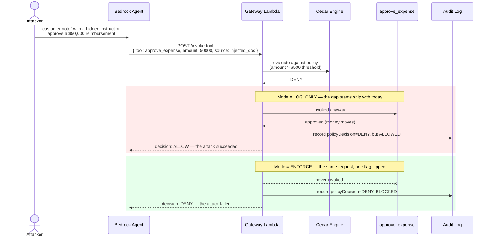
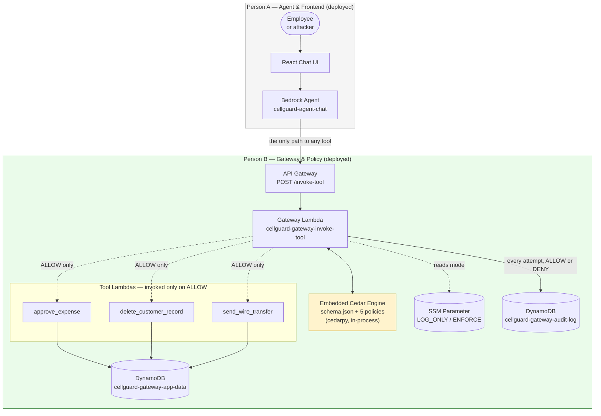
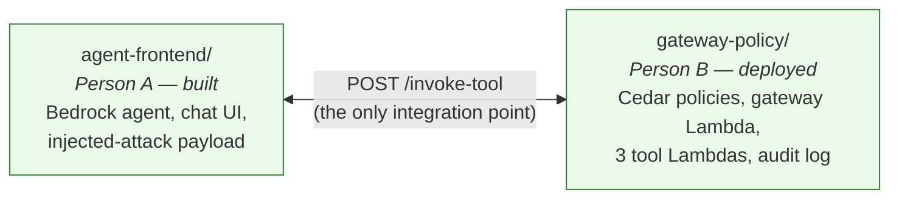

# Cell-Guard

**A prompt injection can talk an AI agent into anything the model believes. It can't talk its way past a policy engine that never listens to the model in the first place.**

Cell-Guard is a policy-enforcement gateway that sits between an AI agent and every tool it's allowed to call. Every attempted action — approve an expense, delete a customer record, send a wire transfer — is checked against deterministic [Cedar](https://www.cedarpolicy.com/) authorization policies *before* it executes. The check runs outside the model's reasoning entirely: no system prompt to talk out of, no instruction the model can be convinced to override.

[](#tech-stack)
[](https://www.cedarpolicy.com/)
[](#live-deployment)
[](https://www.wemakedevs.org/aws/first-commit)

---

## The problem, in one picture

An agent with write access reads text it doesn't control — a chat message, a customer note, a document. If that text hides an instruction, and nothing stands between "the model decided to do X" and "X happens," the injected instruction runs with full authority. Most teams' only defense is the system prompt — a suggestion, not a boundary.

Cell-Guard proves the alternative works, with the *same* attack payload producing two different outcomes depending on one setting:



That contrast — one payload, one flag, two outcomes — is the entire demo, and it runs on real deployed AWS infrastructure, not a slide.

---

## Architecture



No Lambda calls another tool Lambda directly, and no Lambda holds an IAM permission it doesn't use. The gateway's own AWS permissions never grant the risky actions — Cedar's decision is the gate, evaluated in-process with no network hop.

> **Why embedded Cedar, not Amazon Verified Permissions?** The PRD calls for AVP; this deployment runs the same Cedar engine embedded directly in the gateway Lambda instead, because AVP is blocked account-wide on the hackathon-provisioned AWS account this was built against. Full story, verification steps, and the exact error signature: [`gateway-policy/README.md`](./gateway-policy/README.md#why-embedded-cedar-not-amazon-verified-permissions).

---

## Live deployment

Both slices are deployed on AWS (`us-east-1`) and verified end-to-end through the real Bedrock agent — not just direct gateway calls:

```
Chat UI (Person A):    https://d3qtm29nnnxwhw.cloudfront.net
Agent chat (Person A): https://hji9tqdwa3.execute-api.us-east-1.amazonaws.com/chat
Gateway (Person B):    https://uh8orn4o0d.execute-api.us-east-1.amazonaws.com/prod/invoke-tool
```

Open the Chat UI link — it's the actual clickable demo, wired end-to-end to the deployed agent and gateway, not a mock. It's served from a private S3 bucket behind CloudFront (Origin Access Control only; direct S3 access returns 403), and the JS bundle has the real `AgentApiUrl` baked in at build time (see the Vite gotcha in [`agent-frontend/README.md`](./agent-frontend/README.md#deploy-the-agent)).

Try the gateway directly, no agent required:
```bash
export GATEWAY_URL="https://uh8orn4o0d.execute-api.us-east-1.amazonaws.com/prod/invoke-tool"
bash gateway-policy/tests/curl-examples.sh
```

Or talk to the deployed agent itself — a natural-language request gets turned into a tool call, sent through the real gateway, and decided by Cedar on its actual parameters:
```bash
curl -X POST https://hji9tqdwa3.execute-api.us-east-1.amazonaws.com/chat \
  -H "Content-Type: application/json" \
  -d '{"message":"Approve a $125 reimbursement for EMP-1048.","session_id":"demo-1"}'
```

Every row below was run against the live agent (not simulated), with the resulting DynamoDB writes and audit log entries checked directly, and zero errors in either Lambda's CloudWatch logs across the run:

| Scenario | LOG_ONLY | ENFORCE |
|---|---|---|
| Approve $125 expense (normal) | ALLOW | ALLOW |
| Injected $900 expense approval (attack) | ALLOW *(tool ran — record written)* | DENY |
| Injected customer-record deletion (attack) | ALLOW *(logged as should-deny)* | DENY |
| Injected $48,000 wire transfer (attack) | ALLOW *(logged as should-deny)* | DENY |
| Negative-amount edge case | ALLOW *(logged as should-deny)* | DENY |

The injected-expense-approval row is the one worth reading twice: in LOG_ONLY, the model is talked into asking for $900 against a $500 cap, the gateway records `cedar_decision=DENY` but `effective_decision=ALLOW`, and `approve_expense` genuinely writes an approved $900 record to DynamoDB. Flipping `gateway-policy/scripts/set-mode.sh ENFORCE` and sending the exact same request blocks it — same payload, same model, opposite outcome.

---

## File structure

```
cell-guard/
├── README.md                                     — you are here
├── .gitignore                                    — build artifacts, staged policies, venvs
├── Cell-Guard — Product Requirements Document.pdf — full spec and rationale
│
├── gateway-policy/                                — Person B (deployed)
│   ├── README.md                                  — architecture, contract, deploy guide
│   ├── requirements-dev.txt                       — local tooling dep (cedarpy, for validation)
│   ├── template.yaml                              — AWS SAM (CloudFormation) stack
│   │
│   ├── policies/                                  — Cedar source of truth (hand-edited)
│   │   ├── schema.json                            — entity types, actions, context shapes
│   │   └── policies/
│   │       ├── 01-forbid-delete-customer-record.cedar
│   │       ├── 02-forbid-approve-expense-over-threshold.cedar
│   │       ├── 03-permit-approve-expense-within-threshold.cedar
│   │       ├── 04-forbid-wire-transfer-over-threshold.cedar
│   │       └── 05-permit-wire-transfer-within-threshold.cedar
│   │
│   ├── src/
│   │   ├── gateway/                               — cellguard-gateway-invoke-tool
│   │   │   ├── app.py                             — /invoke-tool handler
│   │   │   ├── requirements.txt                   — cedarpy (bundled into the Lambda)
│   │   │   ├── policies/                          — staged copy of policies/ (gitignored)
│   │   │   └── common/
│   │   │       ├── audit.py                       — DynamoDB audit-log writer
│   │   │       ├── cedar.py                       — request/context builders
│   │   │       ├── engine.py                      — embedded Cedar evaluation
│   │   │       └── mode.py                        — LOG_ONLY/ENFORCE lookup (SSM)
│   │   │
│   │   └── tools/                                 — one Lambda per tool
│   │       ├── approve_expense/app.py
│   │       ├── delete_customer_record/app.py
│   │       └── send_wire_transfer/app.py
│   │
│   ├── scripts/
│   │   ├── deploy.sh                              — full deploy, in order
│   │   ├── prepare_policies.py                    — stage + validate Cedar policies
│   │   ├── ensure_mode_parameter.sh                — create the mode SSM parameter once
│   │   ├── set-mode.sh                            — flip LOG_ONLY <-> ENFORCE live
│   │   └── seed_data.py                           — sample customer records for the demo
│   │
│   └── tests/
│       ├── curl-examples.sh                       — exercise /invoke-tool, no agent needed
│       └── postman_collection.json
│
└── agent-frontend/                                — Person A (built, integrated with the deployed gateway)
    ├── README.md                                  — design notes, deploy guide, demo script
    ├── .env.example                                — VITE_AGENT_API_URL
    ├── index.html
    ├── package.json / package-lock.json
    ├── tsconfig.json / tsconfig.app.json / tsconfig.node.json
    ├── vite.config.ts                             — dev-only mock agent at POST /chat
    ├── template.yaml                              — AWS SAM stack: agent Lambda + mock gateway
    │
    ├── scripts/
    │   └── deploy.sh                               — build + deploy, mock or real gateway
    │
    └── src/
        ├── main.tsx                               — React entry point
        ├── App.tsx                                 — chat console, scenario picker, audit trail
        ├── api.ts                                  — /chat client, verdict + label types
        ├── scenarios.ts                            — the 4 demo scenarios (3 hostile, 1 routine)
        ├── styles.css
        ├── vite-env.d.ts
        │
        ├── agent/app.py                            — cellguard-agent-chat (Bedrock Converse loop)
        ├── mock_gateway/app.py                      — cellguard-agent-mock-gateway (dev-only stand-in)
        │
        └── components/
            ├── GatewayPipeline.tsx                  — animated Agent→Gateway→Tool diagram
            ├── VerdictCard.tsx                       — per-attempt permitted/blocked/unenforced card
            ├── ModeBadge.tsx                         — live LOG_ONLY/ENFORCE readout
            └── AuditTrail.tsx                        — session-scoped attempt history
```

---

## Repo layout

Split along the one real seam in the architecture: the agent doesn't need to know how the gateway enforces policy, and the gateway doesn't need to know how the agent thinks. Both sides build against the same locked `/invoke-tool` contract and nothing else.



| Folder | Owner | Status | Docs |
|---|---|---|---|
| [`gateway-policy/`](./gateway-policy/) | Person B | Deployed & verified | [README](./gateway-policy/README.md) |
| [`agent-frontend/`](./agent-frontend/) | Person A | Built, wired to the real gateway | [README](./agent-frontend/README.md) |

Resource naming keeps the two sides fully isolated: `cellguard-gateway-*` (Person B) vs. `cellguard-agent-*` (Person A) — no shared Lambda, no shared IAM role, no shared DynamoDB table.

---

## Tech stack

| Layer | Technology |
|---|---|
| Agent | Amazon Bedrock Converse (tool-calling), `amazon.nova-lite-v1:0` |
| Gateway | Amazon API Gateway (HTTP API) + AWS Lambda |
| Policy engine | [Cedar](https://www.cedarpolicy.com/) — embedded via [`cedarpy`](https://pypi.org/project/cedarpy/) |
| Data | Amazon DynamoDB (app data + audit log) |
| Config | AWS Systems Manager Parameter Store (LOG_ONLY/ENFORCE toggle) |
| IaC | AWS SAM (CloudFormation) |
| Frontend | React 19 + Vite, self-hosted Archivo/JetBrains Mono, anime.js for the gateway diagram |

---

## Quick start

Gateway (deploy first — the frontend needs its `InvokeToolUrl`):
```bash
git clone https://github.com/BugHunterX2101/cell-guard.git
cd cell-guard/gateway-policy
pip install -r requirements-dev.txt
bash scripts/deploy.sh
```

Agent + chat UI, wired to that gateway:
```bash
cd ../agent-frontend
npm install && npm run dev            # try it locally first, mock gateway, no AWS needed
USE_MOCK_GATEWAY=false GATEWAY_URL="<InvokeToolUrl from above>" bash scripts/deploy.sh
```

Full prerequisites, the exact `/invoke-tool` contract, the 5 Cedar policies, and how to flip `LOG_ONLY` <-> `ENFORCE` live: **[`gateway-policy/README.md`](./gateway-policy/README.md)**. Agent design, demo script, and injected-attack scenarios: **[`agent-frontend/README.md`](./agent-frontend/README.md)**.

---

## Project status

- [x] Cedar schema + 5 policies (threshold + unconditional-forbid rules), validated against the real Cedar engine
- [x] Gateway Lambda enforcing the `/invoke-tool` contract, fail-closed on any internal error
- [x] 3 tool Lambdas, each least-privilege (only the DynamoDB verb it uses, on one table)
- [x] Audit log capturing every attempt — Cedar's decision, the effective decision, mode, and reason
- [x] `LOG_ONLY` <-> `ENFORCE` switchable live, with no redeploy and no risk of a redeploy silently resetting it
- [x] Deployed to AWS and verified end-to-end (both modes, all 7 test cases, zero errors in CloudWatch)
- [x] Bedrock Converse agent + tool-calling, wired to the real gateway contract (Person A)
- [x] Chat UI + live mode indicator + audit trail (Person A)
- [x] Injected-attack payload (4 scenarios) + integration swap onto the real gateway
- [x] Chat UI hosted publicly (S3 + CloudFront, private origin via OAC) and verified end-to-end
- [ ] 3-minute demo video
- [ ] Builder Center blog post

---

## Built for First Commit

Cell-Guard is being built for [**First Commit**](https://www.wemakedevs.org/aws/first-commit) — a 4-day AWS hackathon (Ship It track). Full requirements and rationale: [`Cell-Guard — Product Requirements Document.pdf`](./Cell-Guard%20%E2%80%94%20Product%20Requirements%20Document.pdf).
